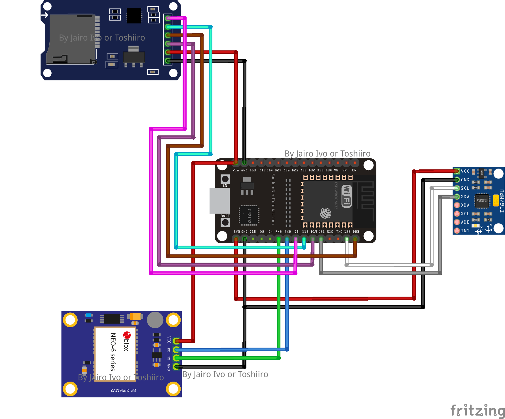

# bicycle-irimeter
# Bicycle Pavement IRI Data Collection

## Project Overview

This Arduino-based project is designed to collect data on the International Roughness Index (IRI) of a bicycle path. It uses an ESP32 microcontroller, a u-blox GPS module, an MPU-9250 accelerometer, and an SD card module for data storage. The system collects data at a rate of 10 samples per second, recording the date, time, latitude, longitude, and accelerometer data. The prototype can be easily mounted on a bicycle for real-world data collection.

## Table of Contents

- [Project Overview](#project-overview)
- [Hardware Components](#hardware-components)
- [Software Requirements](#software-requirements)
- [Installation](#installation)
- [Usage](#usage)
- [Data Output](#data-output)
- [License](#license)

## Hardware Components

- **ESP32 Microcontroller**: The brains of the operation, responsible for data collection and processing.
- **u-blox GPS Module**: Provides accurate GPS coordinates for location tracking.
- **MPU-9250 Accelerometer/Gyroscope**: Measures acceleration and orientation for pavement roughness analysis.
- **SD Card Module**: Used for data storage in CSV format.
- **Prototype PCB**: Designed using Fritzing for easy assembly and integration.

## Software Requirements

To successfully compile and run this project, you'll need the following libraries:

- [MPU9250_asukiaaa](https://github.com/asukiaaa/MPU9250_asukiaaa): Library for the MPU-9250 accelerometer and gyroscope.
- [TinyGPS++](https://github.com/mikalhart/TinyGPSPlus): Library for parsing GPS data.
- [ESP32Time](https://github.com/abelfrancis/esp32time): Library for time and date management on the ESP32.
- [SD](https://www.arduino.cc/en/Reference/SD): Standard Arduino library for using the SD card module.
- [SPI](https://www.arduino.cc/en/Reference/SPI): Standard Arduino library for SPI communication.
- [Wire](https://www.arduino.cc/en/Reference/Wire): Standard Arduino library for I2C communication.

Please ensure that you have these libraries installed in your Arduino IDE before uploading the project sketch.

## Installation

1. Connect the hardware components according to the provided schematic and pinout details in the Fritzing design.

2. Install the necessary libraries for the GPS module, MPU-9250 sensor, and the SD card module using the Arduino Library Manager.

3. Open the Arduino IDE and load the project sketch.

4. Configure the necessary settings in the sketch, such as serial communication, data collection frequency, and data storage to the SD card.

5. Upload the sketch to the ESP32 microcontroller.

## Usage

1. Power up the system and attach it securely to your bicycle.

2. Wait for the GPS module to obtain a fix before starting data collection. This ensures accurate latitude and longitude data.

3. Once the GPS fix is established, the system will begin collecting data and save it to the SD card in CSV format.

4. It's possible to collect data in parallel with a GPS logging app on your smartphone, such as GPS Logger. This redundancy helps maintain data integrity, as the device continues collecting data with date and time, even if latitude and longitude data are temporarily lost.

5. After your data collection is complete, stop the system and disconnect the power.

## Data Output

The system will collect the following data and save it to the SD card in CSV format:

- Date and Time: Timestamp for each data point.
- Latitude and Longitude: GPS coordinates for location tracking.
- Accelerometer Data: Acceleration and orientation data from the MPU-9250 sensor.

The collected data can be easily transferred to a computer for further analysis.

## License

This project is open-source and released under the [GNU General Public License, version 3.0 (GPL-3.0)](https://www.gnu.org/licenses/gpl-3.0.html). You are free to use, modify, and distribute this project as long as you give credit to the original authors.
